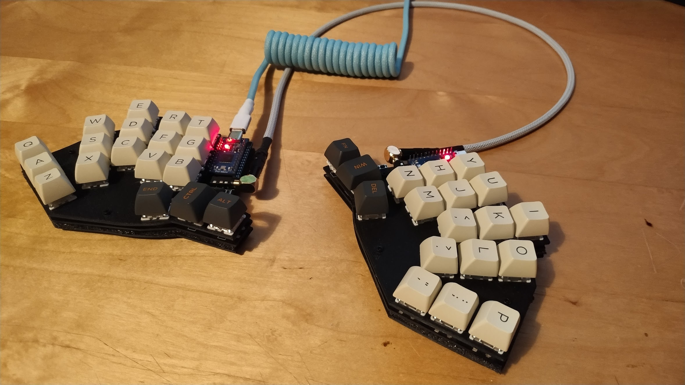
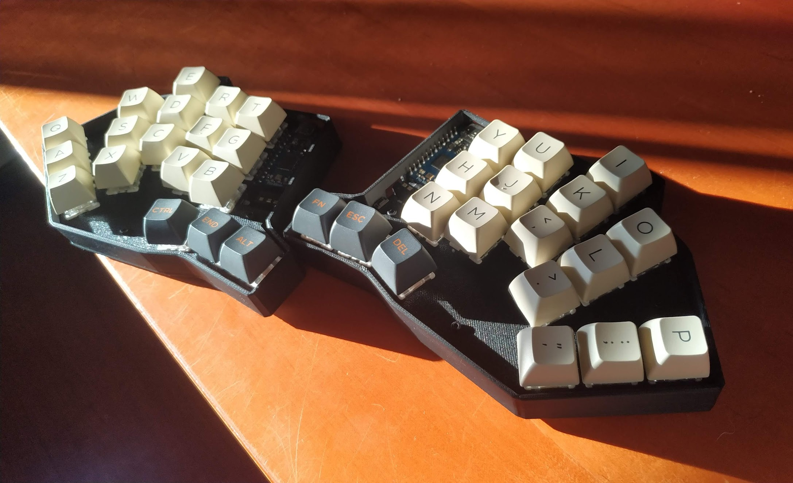

  

 
 

# Welcome

[![CC BY-NC-SA 4.0][cc-by-nc-sa-shield]][cc-by-nc-sa]

This is the home of my first keyboard project that I dubbed `Yggdrasil`.

It's a 36% split keyboard that is tailored to be comfortable to my hand span. You can find the build guide [here](./docs/build.md).

You can view [here](https://www.youtube.com/watch?v=r2uFzhUAN9s) to see it in action.

Here's what it looks like (minus plates)

And with 3d printed plates (and custom cables also done by me hehe :) )

Full wrap around case, also 3d printed

## Contents

- [Welcome](#welcome)
  - [Contents](#contents)
  - [Design Article](#design-article)
  - [Plans](#plans)
  - [References](#references)
  - [License](#license)

## Design Article

If you're interested in knowing more about the design process that I went through and the final cost for me (in Portugal), I wrote a [post](https://loyalpotato.com/projects/yggdrasil) about it :)

## Plans

You can go to the projects tab to see what my current plans for the first version of this board are.

~~I do plan on making a low profile kailh choc variant, but only after I complete the cherry variant will I start working on a choc one.~~ I ended up using a footprint that has support for both :)

At some point I also would like to add to each version an alternative with a rotary encoder, and will create separate variants for that as well.

After I get more familiar with the process of pcb design and manufacturing I'd like to have a try at having a modular pcb, like the corne, where we can break the extra keys that you don't need.

---

## References

- [Ergogen](https://github.com/ergogen/ergogen) and the kind people from their [discord](https://discord.gg/nbKcAZB)
- [Ben Vallack's](https://github.com/benvallack/ergogen) flipper ergogen config and his youtube [video](https://www.youtube.com/watch?v=UKfeJrRIcxw)
- [Corne Kbd](https://github.com/foostan/crkbd)
- [ruiqimao's guide](https://github.com/ruiqimao/keyboard-pcb-guide)
- [tapioki's Architeuthis dux](https://github.com/tapioki/cephalopoda/tree/main/Architeuthis%20dux)
- [Lily58](https://github.com/kata0510/Lily58)
- [Keyboard Atelier's Discord](https://discord.gg/b7vwhHS)

## License

This work is licensed under a [Creative Commons Attribution-ShareAlike 4.0 International License][cc-by-nc-sa].

[![CC BY-NC-SA 4.0][cc-by-nc-sa-image]][cc-by-nc-sa]

[cc-by-nc-sa]: http://creativecommons.org/licenses/by-nc-sa/4.0/
[cc-by-nc-sa-image]: https://licensebuttons.net/l/by-nc-sa/4.0/88x31.png
[cc-by-nc-sa-shield]: https://img.shields.io/badge/License-CC%20BY--NC--SA%204.0-lightgrey.svg
