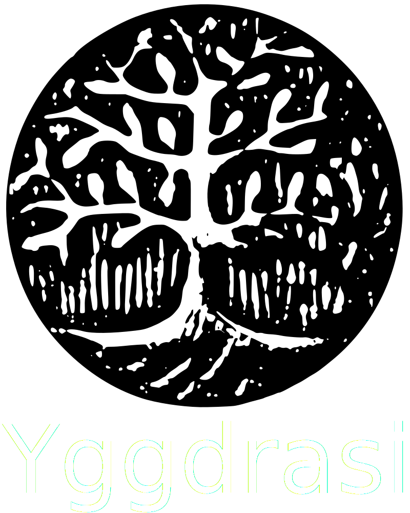

  

 
 

# Welcome

[![CC BY-SA 4.0][cc-by-sa-shield]][cc-by-sa]

This is the home of my first keyboard project that I dubbed `Yggdrasil`.

## Contents

- [Welcome](#welcome)
  - [Contents](#contents)
  - [Images](#images)
  - [Plans](#plans)
  - [References](#references)

## Images

Images will be added as the project progresses.

## Plans

You can go to the projects tab to see what my current plans for the first version of this board are.

~~I do plan on making a low profile kailh choc variant, but only after I complete the cherry variant will I start working on a choc one.~~ I ended up using a footprint that has support for both :)

At some point I also would like to add to each version an alternative with a rotary encoder, and will create separate variants for that as well.

After I get more familiar with the process of pcb design and manufacturing I'd like to have a try at having a modular pcb, like the corne, where we can break the extra keys that you don't need.

---

## References

- [Ergogen](https://github.com/ergogen/ergogen) and the kind people from their [discord](https://discord.gg/nbKcAZB)
- [Ben Vallack's](https://github.com/benvallack/ergogen) flipper ergogen config and his youtube [video](https://www.youtube.com/watch?v=UKfeJrRIcxw)
- [Corne Kbd](https://github.com/foostan/crkbd)
- [ruiqimao's guide](https://github.com/ruiqimao/keyboard-pcb-guide)
- [tapioki's Architeuthis dux](https://github.com/tapioki/cephalopoda/tree/main/Architeuthis%20dux)
- [Lily58](https://github.com/kata0510/Lily58)
- [Keyboard Atelier's Discord](https://discord.gg/b7vwhHS) 

## License 

This work is licensed under a [Creative Commons Attribution-ShareAlike 4.0 International License][cc-by-sa].

[![CC BY-SA 4.0][cc-by-sa-image]][cc-by-sa]

[cc-by-sa]: http://creativecommons.org/licenses/by-sa/4.0/
[cc-by-sa-image]: https://licensebuttons.net/l/by-sa/4.0/88x31.png
[cc-by-sa-shield]: https://img.shields.io/badge/License-CC%20BY--SA%204.0-lightgrey.svg
