# Build Guide

This build guide will cover the steps that you need to take in order to build this keyboard.

## Contents

  - [Parts](#parts)
  - [PCB](#pcb)
  - [Hotswap Sockets](#hotswap-sockets)
  - [Diodes](#diodes)
  - [TRRS & Reset Button](#trrs--reset-button)
  - [Micro controller](#micro-controller)
  - [Plates](#plates)
  - [QMK](#qmk)

## NOTE

This is a WIP file. More information will be added as the build progresses

## Parts

| Parts | Quantity | Notes |
| --- | :---: | --- |
| PCB | 2 | Project avaliable [here](/kicad/). I ordered from JLCPCB |
| Plates | (Top + Bottom) * 2 | Go [here](/plates/) and choose the latest revision |
| [USB-C ProMicro](https://www.aliexpress.com/item/1348800135.html) | 2 | Slight length difference from Micro USB ProMicro |
| [TRRS Jacks](https://www.aliexpress.com/item/4000661212458.html) | 2 ||
| [Kailh Hot-swap Sockets](https://www.aliexpress.com/item/4001051840976.html) | 36 ||
| Diodes 1N4148 / 1N4148W | 36 | I used the [SMD](https://www.aliexpress.com/item/32334222067.html) version ||
| [Tact Switch](https://www.aliexpress.com/item/1005001629236725.html)| 2 ||
| [M2 Spacer](https://www.aliexpress.com/item/32974970926.html) | 10 | 6mm|
| [M2 Screw](https://www.aliexpress.com/item/32974970926.html) | 20 | 3mm|
| TRRS Cable | 1 ||
| USB-C Cable | 1 ||
| (Optional) Rubber Feet | Up to you ||

## PCB

For the pcb all you need to do is order two as the pcb is reversible.
I haven't tested compatibility with a regular micro/mini pro micro or the elite-c micro controllers, but the one I mention above works as I designed the pcb with it in mind.
This is what is looks like bare.

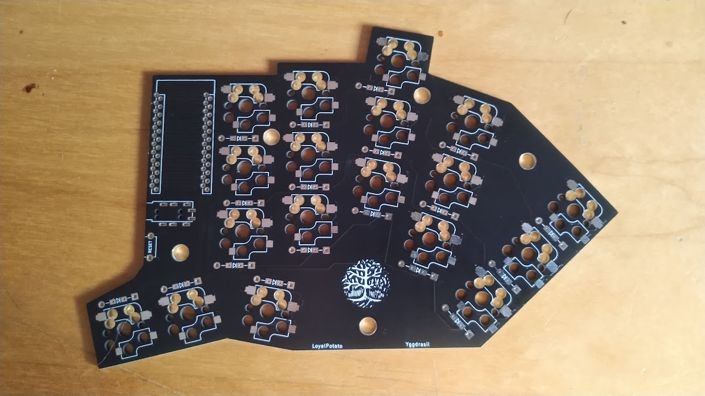

## Hotswap Sockets

This is in no specific order, but the order in which I did mine. But I'd recommend with either starting here or with the diodes and leaving the microcontroller for last.

I started with putting solder in the pads on the respective side, like so:

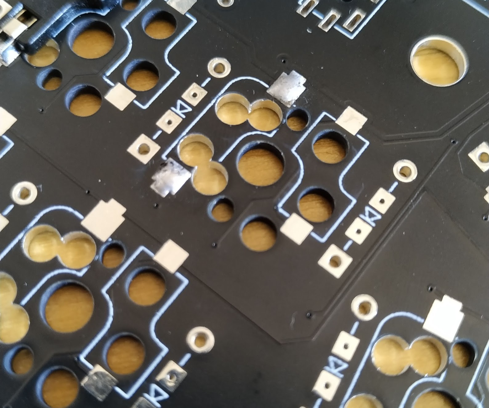

After that is done for all the pads of the hotswap you can procede to the next step which is placing the sockets in they're respective holes.

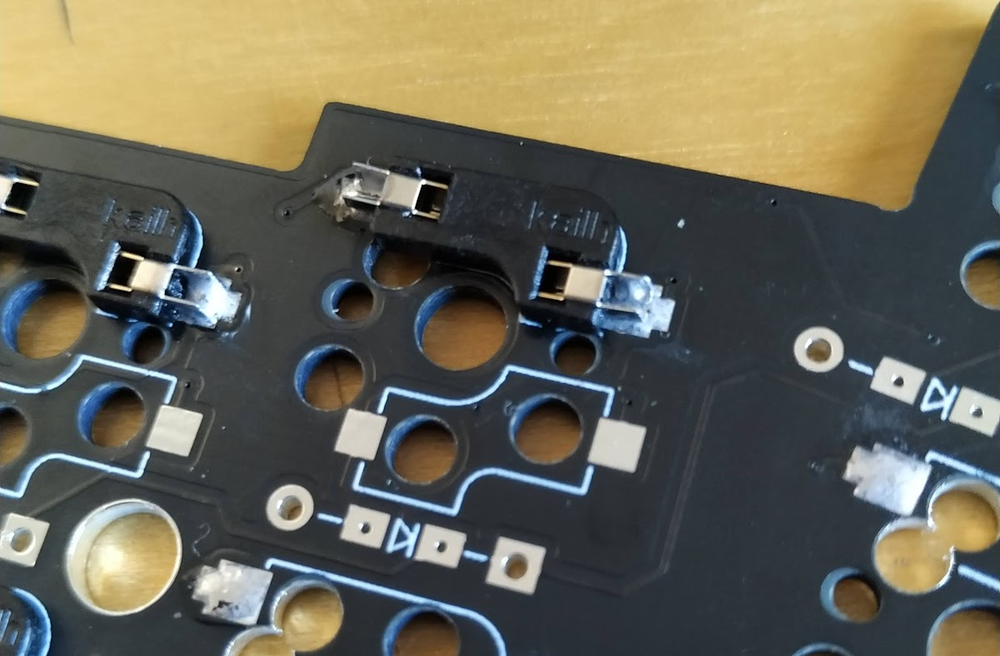

A trick that worked for me was placing a tweezer or something similar on the metal part of the socket of the side you are soldering. Then with the iron heat up the pad while pressing with the tweezers down and it should go down. Double check to see if the socket is flush with the pcb.

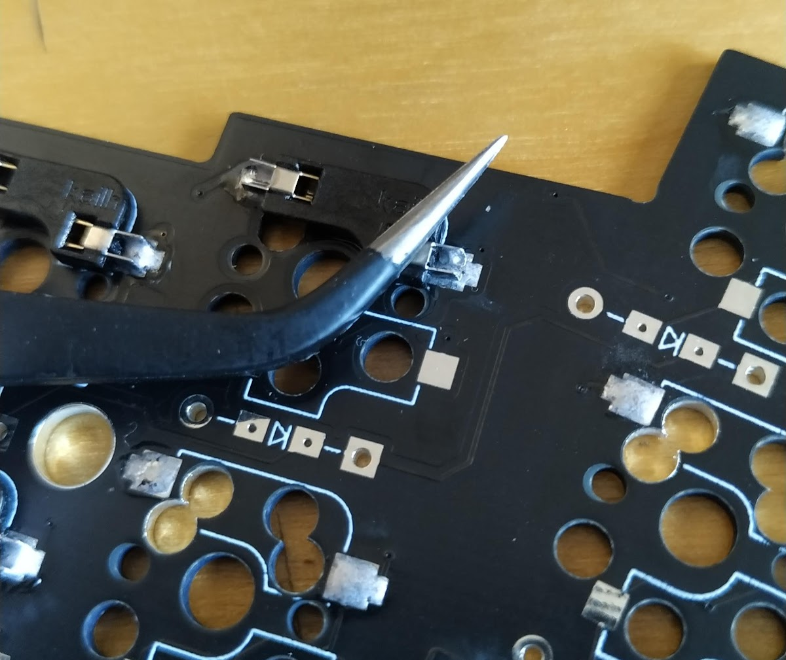

When you are done with both sides it should look something like this

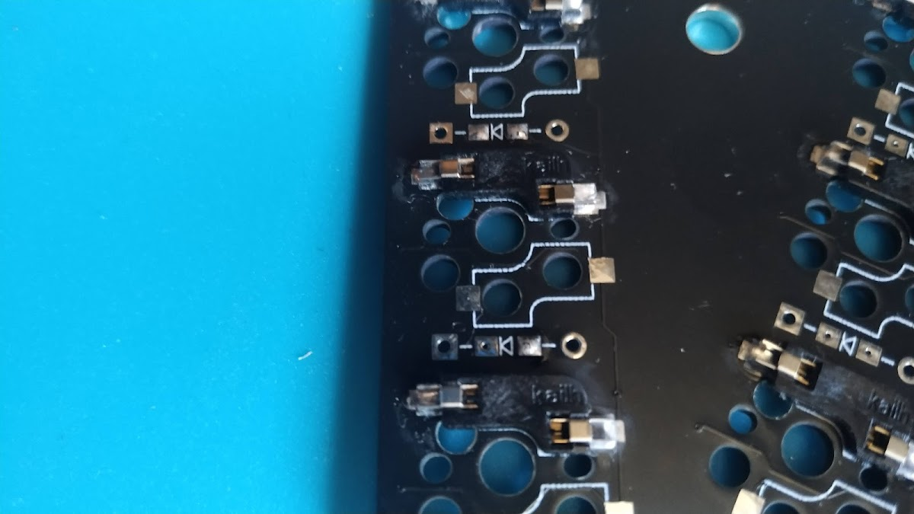

Repeat the same process for the other side and the rest of the sockets.

## Diodes

The process for the diodes is pretty similar to the process of the sockets.

First you need to check the direction of the diode.
The diode will have one of the sides with a little line to indicate the cathode side, like so:

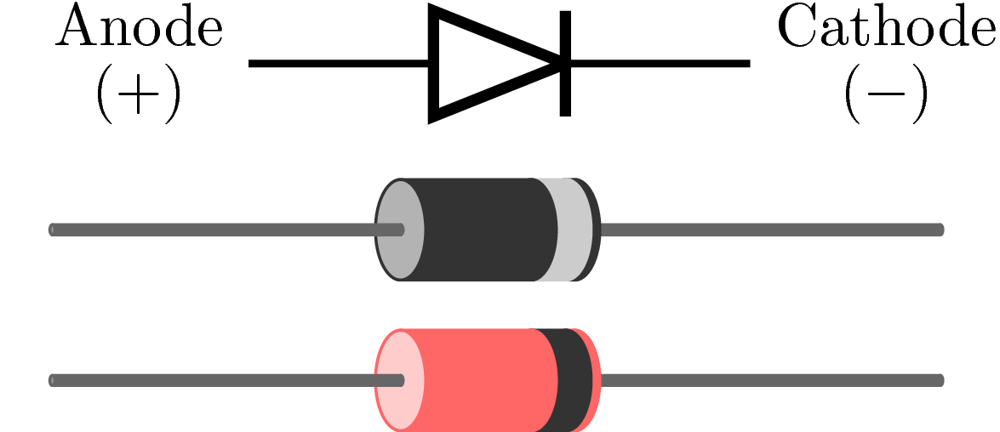

And in the pcb it's marked with the same drawing

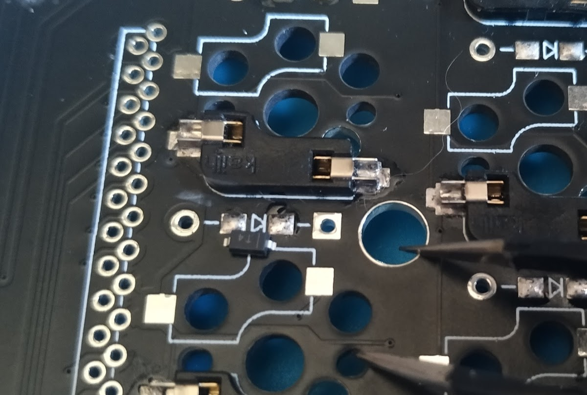

For the soldering process, like I mentioned above it's pretty similar to the sockets. First put the solder in the pads, then place the diode with the correct orientation and solder one side. After that solder the other one while putting a slight pressure on the diode. Be very careful with the pressure as you only need a little bit for it to go down.

Make sure that the pron of the diode is fully covered with solder as this can lead to the key not inputting correctly.

After you're done with that you're keyboard halve/halves should look like the following picture, with the sockets soldered as well.

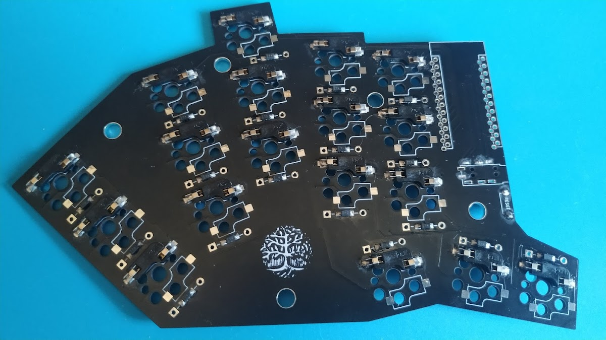

## TRRS & Reset Button

I recommend, even though you may see otherwise in the previous pictures, to solder these at the end or before the micro controller as the height difference may cause some issues while soldering the previous components.

These are pretty easy to solder. For the jack, just point it out and solder underneath. And for the reset button it doesn't matter the orientation, but bend the pins or cut them so they are flush (if you find it better to leave as is it's also good).

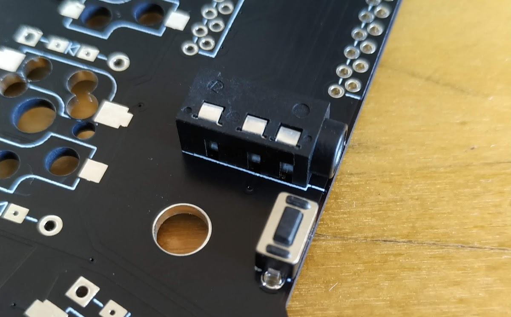

## Micro controller

The final component that needs to be soldered is the micro controller.

Before soldering though, make sure that it turns on and that you can flash it so that you don't have to go through the pain of desoldering it if something isn't working. You view the flashing process [here](#qmk).

To start first insert the mcu in the correct pins, both of them facing up. You can use the next picture for guidance.

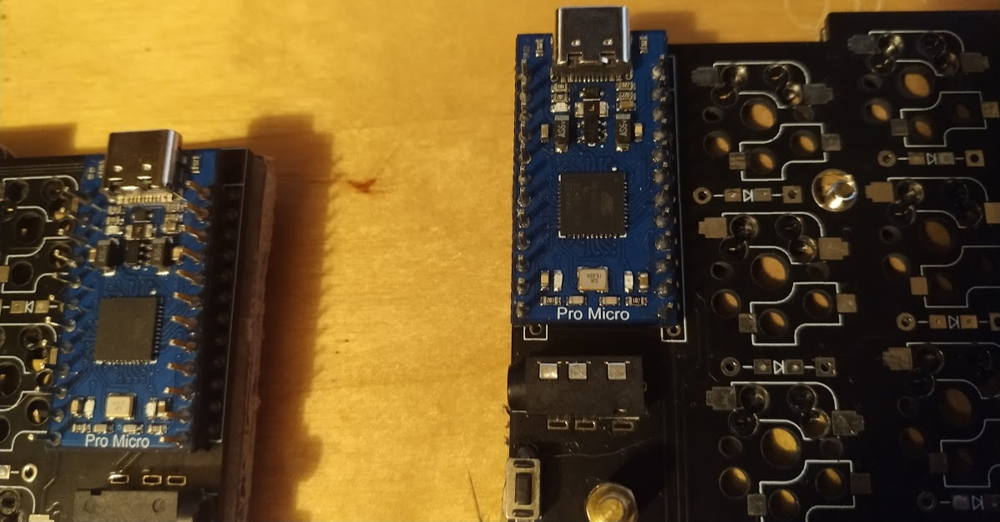

When you've figured out the orientation flip it around and solder each of the pins. 

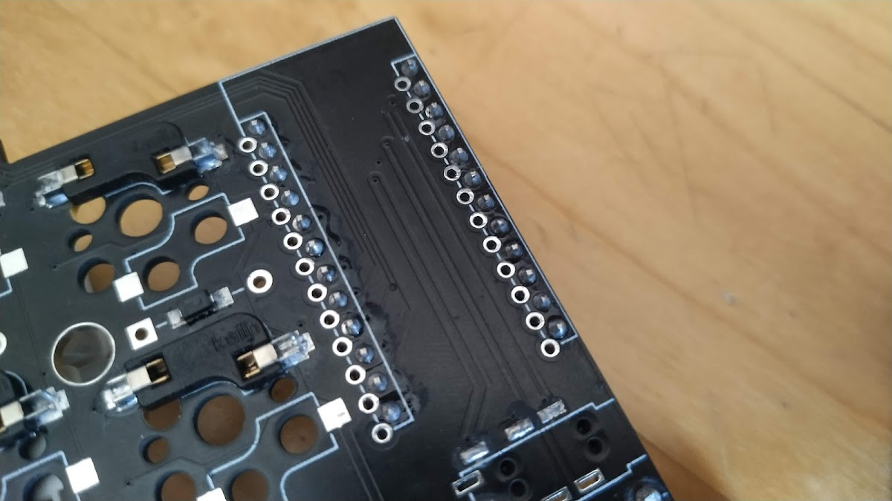

After that flip it again and solder the pins on the top and you're finished :)

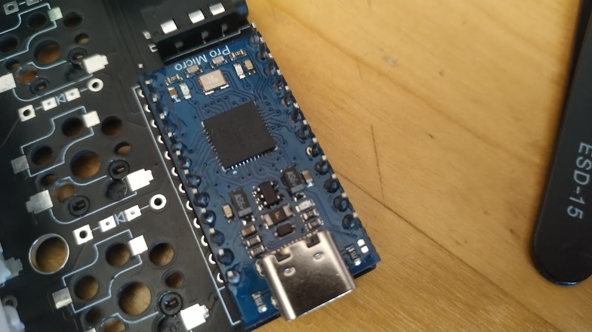


## Plates

TODO

## QMK

Flashing is also pretty simple. I used QMK as the firmware for my board so I will document only that, for now.

If the keyboard isn't in the official qmk repo the use my [fork](https://github.com/LoyalPotato/qmk_firmware) and procede to the next step.

Follow their [setup guide](https://docs.qmk.fm/#/newbs_getting_started) to get the qmk cli available in you're machine.

Once you have qmk you need to flash the keyboard with the chosen keymap, for example:

```shell
qmk flash -kb loyalpotato/yggdrasil/rev1 -km LoyalPotato
```

And you should have a fully functioning Yggdrasil board :D

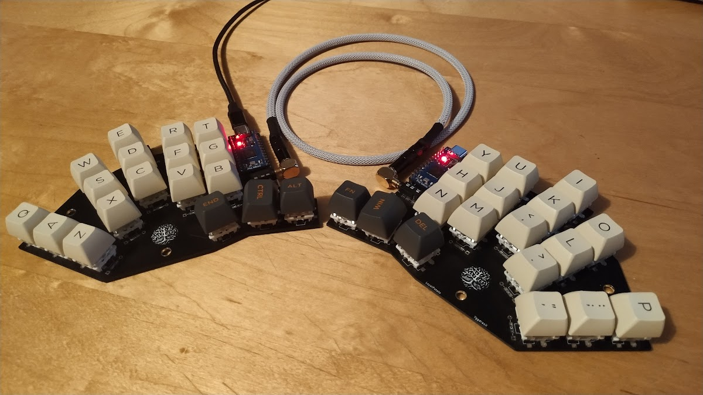

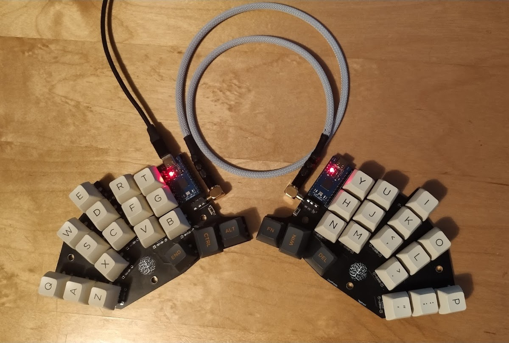
